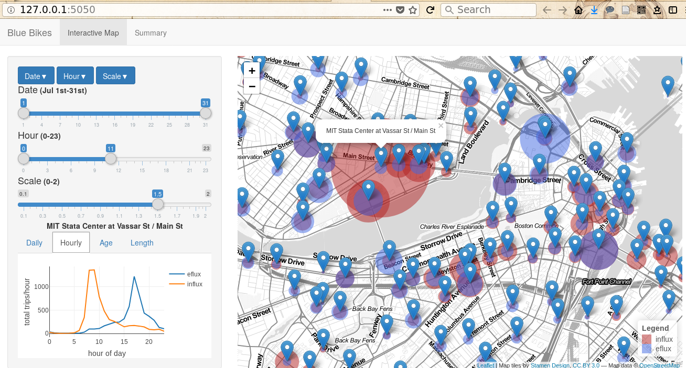

# BlueBikes_Shiny_App
Using powerful R Shiny toolsets to building interactive dashboard exploring Boston's BlueBike usage data.

Demonstrating interactions between input sliders, leaflet map, and plotply plots.

Customized with Bootstrap elements, CSS and Javascript.

Screenshot:

